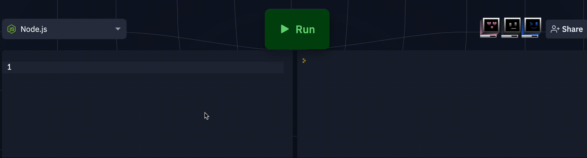

# Buddy AI - Firefox Extension

Buddy AI is a powerful Firefox extension that brings the capabilities of the ChatGPT API right to your fingertips while you browse the web. With this extension, you can effortlessly interact with the ChatGPT model to generate text, code, or any other content you need. The extension allows you to use ChatGPT in textareas or textfields on webpages using a simple `$buddy` prefix. Let's get started!

## Table of Contents

- [Features](#features)
- [Installation](#installation)
- [Usage](#usage)
- [Configuration](#configuration)
- [Keyboard Shortcut](#keyboard-shortcut)
- [Contributing](#contributing)
- [License](#license)

## Features

- **Seamless Integration:** Easily utilize the power of ChatGPT within textareas and textfields on webpages.
- **Natural Language Interaction:** Communicate with the ChatGPT model using natural language commands.
- **Code Generation:** Rapidly generate code snippets by typing out your requirements using the `$buddy` prefix.
- **Configurable:** Tailor the extension's behavior to your preferences using the configuration options.

## Installation

To install the ChatGPT Buddy extension, follow these steps:

1. Clone this GitHub repository or download it as a ZIP archive and extract it.
2. Open Firefox and enter `about:debugging` in the address bar.
3. Click on "This Firefox" in the left sidebar.
4. Click the "Load Temporary Add-on" button.
5. Navigate to the directory where you cloned or extracted the repository, and select the `manifest.json` file.

The ChatGPT Buddy extension should now be installed and ready to use!

## Usage

Using the ChatGPT Buddy extension is simple and intuitive:

1. Navigate to a webpage with a textarea or textfield where you want to use ChatGPT.
2. Click inside the textarea or textfield to activate it.
3. Begin your command by typing `$buddy`, followed by your request. For instance: `$buddy Explain the concept of object-oriented programming.`
4. After typing your request, press the ALT/Option key to send the command to the ChatGPT model.
5. Watch as ChatGPT generates a response tailored to your request and displays it in the textarea or textfield.

## Configuration

You can configure the Buddy AI extension by clicking on its icon in the Firefox toolbar and selecting "Options." Here, you can adjust settings such as language preferences, response length, and more to customize your experience.

## Keyboard Shortcut

The default keyboard shortcut to send a command to ChatGPT is the ALT/Option key. If you prefer a different shortcut, you can modify it in the extension's options.

## Contributing

We welcome contributions from the community! If you'd like to contribute to the Buddy AI extension, please follow these steps:

1. Fork this repository.
2. Create a new branch for your feature or bug fix.
3. Make your changes and test thoroughly.
4. Create a pull request explaining your changes and their benefits.

## License

This extension is licensed under the [MIT License](LICENSE). Feel free to use, modify, and distribute it in accordance with the terms of the license.

---

Enjoy using ChatGPT Buddy to enhance your browsing experience and streamline your interactions with the ChatGPT model. If you encounter any issues or have suggestions for improvements, please don't hesitate to [open an issue](../../issues). Happy browsing and generating content with ease!
